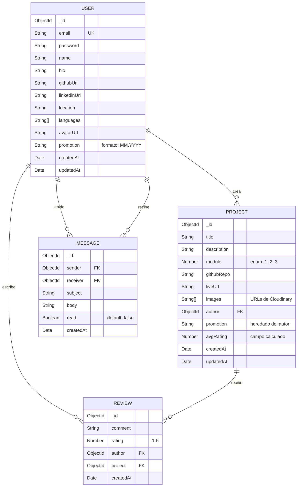

# Iron Projects — Product Requirements Document

## 1. Visión del producto

**Iron Projects** es una plataforma web para alumnos de Ironhack (bootcamp Web Development) donde pueden registrar, descubrir y valorar los proyectos finales de módulo de toda la comunidad.

El objetivo es crear un portfolio colectivo que sirva de inspiración, referencia y networking entre promociones.

### Propuesta de valor

- **Descubrimiento**: explorar proyectos reales de otros alumnos filtrados por promoción y módulo.
- **Visibilidad**: cada alumno tiene un perfil público con sus proyectos y enlaces profesionales.
- **Feedback**: sistema de reviews con valoración para dar y recibir retroalimentación.
- **Networking**: mensajería privada entre alumnos para colaborar o pedir consejo.

---

## 2. Stack tecnológico

| Capa       | Tecnología                          |
| ---------- | ----------------------------------- |
| Frontend   | React (Vite)                        |
| Backend    | Express.js                          |
| Base datos | MongoDB + Mongoose                  |
| Auth       | express-session + cookies (email + password) |
| Imágenes   | Cloudinary                          |
| Deploy     | Adaptable.io / Render + Netlify     |

---

## 3. Usuarios y roles

### Rol único: Alumno

No existe panel de administración. Todos los usuarios registrados tienen los mismos permisos.

| Acción                         | Alumno |
| ------------------------------ | :----: |
| Registrarse con código         |   ✅   |
| Crear/editar perfil propio     |   ✅   |
| Ver perfiles de otros alumnos  |   ✅   |
| Crear/editar proyectos propios |   ✅   |
| Eliminar proyectos propios     |   ✅   |
| Explorar proyectos con filtros |   ✅   |
| Escribir reviews               |   ✅   |
| Enviar/recibir mensajes        |   ✅   |

### Acceso por código de invitación

Se utiliza un **código único global** (variable de entorno `INVITE_CODE`) que se comparte con los alumnos de Ironhack. Se valida en el registro.

---

## 4. User Stories

### Autenticación

| ID   | Historia                                                                                    | Prioridad |
| ---- | ------------------------------------------------------------------------------------------- | --------- |
| US01 | Como visitante, quiero registrarme con email, password y código de invitación               | Must      |
| US02 | Como visitante, quiero iniciar sesión con email y password                                  | Must      |
| US03 | Como alumno, quiero cerrar sesión                                                           | Must      |
| US04 | Como alumno, quiero iniciar sesión con GitHub *(bonus)*                                     | Nice      |

### Perfil

| ID   | Historia                                                                                    | Prioridad |
| ---- | ------------------------------------------------------------------------------------------- | --------- |
| US05 | Como alumno, quiero crear y editar mi perfil (nombre, bio, github, linkedin, etc.)          | Must      |
| US06 | Como alumno, quiero subir un avatar a mi perfil                                             | Must      |
| US07 | Como alumno, quiero visitar el perfil de otro alumno y ver sus proyectos                    | Must      |

### Proyectos

| ID   | Historia                                                                                    | Prioridad |
| ---- | ------------------------------------------------------------------------------------------- | --------- |
| US08 | Como alumno, quiero crear un proyecto con título, descripción, módulo, repo, enlace e imágenes | Must   |
| US09 | Como alumno, quiero editar o eliminar mis propios proyectos                                 | Must      |
| US10 | Como alumno, quiero ver el listado de todos los proyectos                                   | Must      |
| US11 | Como alumno, quiero filtrar proyectos por módulo (1, 2, 3)                                  | Must      |
| US12 | Como alumno, quiero filtrar proyectos por promoción (mes.año)                               | Must      |
| US13 | Como alumno, quiero ver el detalle de un proyecto con sus reviews                           | Must      |

### Reviews

| ID   | Historia                                                                                    | Prioridad |
| ---- | ------------------------------------------------------------------------------------------- | --------- |
| US14 | Como alumno, quiero dejar una review con comentario y valoración (1-5) en un proyecto       | Must      |
| US15 | Como alumno, quiero ver las reviews de un proyecto                                          | Must      |

### Mensajería

| ID   | Historia                                                                                    | Prioridad |
| ---- | ------------------------------------------------------------------------------------------- | --------- |
| US16 | Como alumno, quiero enviar un mensaje privado a otro alumno                                 | Must      |
| US17 | Como alumno, quiero ver mi bandeja de entrada con los mensajes recibidos                    | Must      |
| US18 | Como alumno, quiero leer y responder mensajes                                               | Must      |

---

## 5. Modelo de datos



---

## 6. Wireframes (layout)

### 8.1 Listado de proyectos

```
┌──────────────────────────────────────────────────────────┐
│  🔶 Iron Projects          Proyectos  Mensajes  👤 Perfil│
├──────────────────────────────────────────────────────────┤
│                                                          │
│  Filtros:  [Módulo ▾]  [Promoción ▾]      🔍 Buscar     │
│                                                          │
│  ┌─────────────┐ ┌─────────────┐ ┌─────────────┐       │
│  │  📷 imagen  │ │  📷 imagen  │ │  📷 imagen  │       │
│  │             │ │             │ │             │       │
│  │ Título      │ │ Título      │ │ Título      │       │
│  │ Módulo 2    │ │ Módulo 1    │ │ Módulo 3    │       │
│  │ ⭐ 4.2      │ │ ⭐ 3.8      │ │ ⭐ 4.9      │       │
│  │ @alumno     │ │ @alumno     │ │ @alumno     │       │
│  └─────────────┘ └─────────────┘ └─────────────┘       │
│                                                          │
│  ┌─────────────┐ ┌─────────────┐ ┌─────────────┐       │
│  │  📷 imagen  │ │  📷 imagen  │ │  📷 imagen  │       │
│  │             │ │             │ │             │       │
│  │ Título      │ │ Título      │ │ Título      │       │
│  │ Módulo 1    │ │ Módulo 3    │ │ Módulo 2    │       │
│  │ ⭐ 4.0      │ │ ⭐ 3.5      │ │ ⭐ 4.7      │       │
│  │ @alumno     │ │ @alumno     │ │ @alumno     │       │
│  └─────────────┘ └─────────────┘ └─────────────┘       │
│                                                          │
│              [  1  ] [ 2 ] [ 3 ] [ → ]                  │
└──────────────────────────────────────────────────────────┘
```

### 8.2 Detalle de proyecto

```
┌──────────────────────────────────────────────────────────┐
│  🔶 Iron Projects          Proyectos  Mensajes  👤 Perfil│
├──────────────────────────────────────────────────────────┤
│                                                          │
│  ← Volver                                                │
│                                                          │
│  ┌────────────────────────────────────────────────┐      │
│  │                                                │      │
│  │            📷  Galería de imágenes              │      │
│  │             ◀  [ 1 / 3 ]  ▶                    │      │
│  │                                                │      │
│  └────────────────────────────────────────────────┘      │
│                                                          │
│  Título del proyecto                       ⭐ 4.2 (12)   │
│  Módulo 2  ·  Promoción 09.2025                          │
│                                                          │
│  Descripción completa del proyecto lorem ipsum dolor     │
│  sit amet consectetur adipiscing elit...                 │
│                                                          │
│  [🔗 GitHub Repo]  [🌐 Ver Live]                         │
│                                                          │
│  👤 Nombre del autor                                     │
│  ────────────────────────────────────────                │
│                                                          │
│  Reviews (12)                                            │
│  ┌──────────────────────────────────────────────┐        │
│  │ 👤 Alumno X  ·  ⭐⭐⭐⭐☆  ·  hace 2 días      │        │
│  │ Muy buen proyecto, la UI está genial...       │        │
│  └──────────────────────────────────────────────┘        │
│  ┌──────────────────────────────────────────────┐        │
│  │ 👤 Alumno Y  ·  ⭐⭐⭐⭐⭐  ·  hace 5 días      │        │
│  │ Excelente trabajo con la API...               │        │
│  └──────────────────────────────────────────────┘        │
│                                                          │
│  Escribe tu review:                                      │
│  Valoración: ⭐⭐⭐⭐☆                                     │
│  ┌──────────────────────────────────────────────┐        │
│  │ Tu comentario...                              │        │
│  └──────────────────────────────────────────────┘        │
│  [ Enviar review ]                                       │
│                                                          │
└──────────────────────────────────────────────────────────┘
```

### 8.3 Perfil de alumno

```
┌──────────────────────────────────────────────────────────┐
│  🔶 Iron Projects          Proyectos  Mensajes  👤 Perfil│
├──────────────────────────────────────────────────────────┤
│                                                          │
│  ┌──────┐                                                │
│  │      │  Nombre del Alumno                             │
│  │ 👤   │  📍 Barcelona  ·  Promoción 09.2025            │
│  │avatar│  🗣 ES, EN, FR                                 │
│  │      │                                                │
│  └──────┘  [GitHub] [LinkedIn] [✉️ Enviar mensaje]       │
│                                                          │
│  Bio del alumno. Desarrollador fullstack apasionado      │
│  por el frontend y las APIs REST...                      │
│                                                          │
│  ── Proyectos (3) ─────────────────────────────────────  │
│                                                          │
│  ┌─────────────┐ ┌─────────────┐ ┌─────────────┐       │
│  │  📷 imagen  │ │  📷 imagen  │ │  📷 imagen  │       │
│  │ Proyecto M1 │ │ Proyecto M2 │ │ Proyecto M3 │       │
│  │ ⭐ 4.2      │ │ ⭐ 3.8      │ │ ⭐ 4.9      │       │
│  └─────────────┘ └─────────────┘ └─────────────┘       │
│                                                          │
└──────────────────────────────────────────────────────────┘
```

### 8.4 Bandeja de mensajes

```
┌──────────────────────────────────────────────────────────┐
│  🔶 Iron Projects          Proyectos  Mensajes  👤 Perfil│
├──────────────────────────────────────────────────────────┤
│                                                          │
│  Mensajes                          [✉️ Nuevo mensaje]    │
│                                                          │
│  ┌──────────────────────────────────────────────┐        │
│  │ 🔵 👤 Alumno X                    hace 2h    │        │
│  │    Re: Pregunta sobre tu proyecto M2          │        │
│  └──────────────────────────────────────────────┘        │
│  ┌──────────────────────────────────────────────┐        │
│  │    👤 Alumno Y                    hace 1 día  │        │
│  │    Gracias por el feedback!                   │        │
│  └──────────────────────────────────────────────┘        │
│  ┌──────────────────────────────────────────────┐        │
│  │    👤 Alumno Z                    hace 3 días │        │
│  │    Hola! Vi tu proyecto y me encantó...       │        │
│  └──────────────────────────────────────────────┘        │
│                                                          │
└──────────────────────────────────────────────────────────┘
```

---

## 9. Reglas de negocio

| #  | Regla                                                                                   |
| -- | --------------------------------------------------------------------------------------- |
| R1 | El código de invitación se valida contra la variable de entorno `INVITE_CODE`            |
| R2 | Un alumno solo puede editar/eliminar sus propios proyectos                               |
| R3 | Un alumno no puede escribir más de una review por proyecto                               |
| R4 | Un alumno no puede hacer review de su propio proyecto                                    |
| R5 | La valoración de un review debe ser un entero entre 1 y 5                                |
| R6 | El campo `avgRating` del proyecto se recalcula tras cada nueva review                    |
| R7 | La promoción tiene formato `MM.YYYY` (ej: `09.2025`)                                    |
| R8 | El módulo es un enum con valores `1`, `2` o `3`                                          |
| R9 | Las imágenes de proyectos se suben a Cloudinary (máx. 5 por proyecto)                    |
| R10| El avatar del usuario se sube a Cloudinary                                               |
| R11| Los mensajes marcados como leídos no pueden volver a estado no leído                     |

---

## 10. Bonus (post-MVP)

| Feature                          | Descripción                                                      |
| -------------------------------- | ---------------------------------------------------------------- |
| Login con GitHub                 | OAuth con GitHub como método de autenticación alternativo         |
| Login con Slack                  | OAuth con Slack para alumnos que usan el workspace de Ironhack   |
| Búsqueda por texto               | Buscador full-text en títulos y descripciones de proyectos       |
| Likes / Favoritos                | Guardar proyectos como favoritos para acceder rápidamente        |
| Ordenar por valoración           | Ordenar listado de proyectos por media de reviews                |
| Notificaciones in-app            | Badge de mensajes no leídos, notificación de nuevas reviews      |
| Dark mode                        | Tema oscuro para la interfaz                                     |
| Responsive / PWA                 | Diseño responsive y experiencia tipo app en móvil                |
